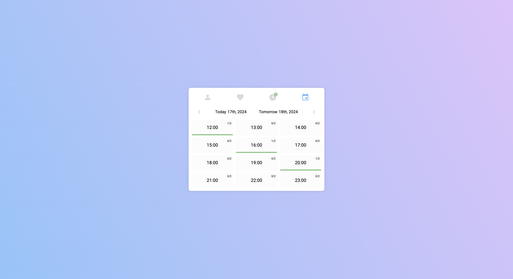
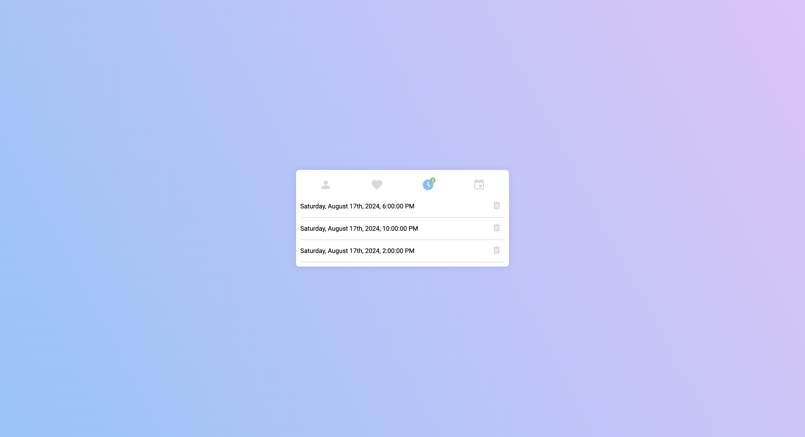

# Interview Objedname.eu

This project was created during interview process to Objedname.eu for a position Front End Developer.

## Installation

In order to launch this project locally, go to the client folder, using NPM install all the dependencies and start the project:
```bash
cd client
npm i
npm start
```

After some time the user should be able to access client application at `localhost:3000`

## Screenshots

**Calendar**


**Reservations**


## Issues

The task description mentioned "refactoring the HTML and JS into components". However, this was challenging because the provided source code contained only two HTML files (`example_js_generator.html` and `timedOrdersView.html`). As a result, this project was more about creating a new application based on the assignment’s screenshot rather than refactoring the existing code. Nevertheless, I was able to reuse some helpful functions from `timedOrdersView.js`.